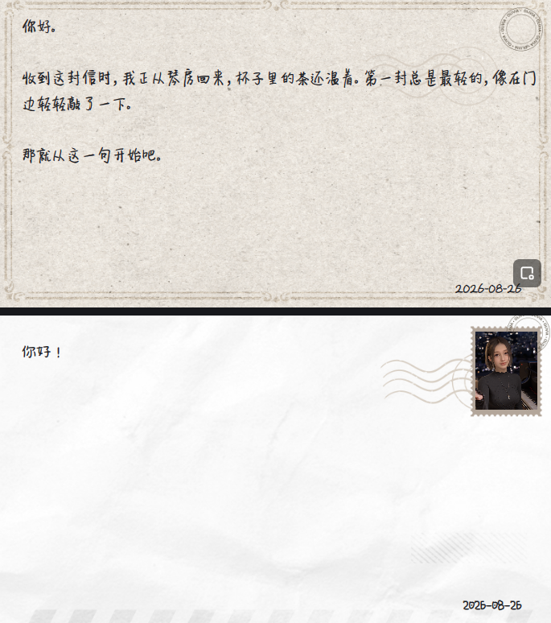

*大家好，我是~~伊朗人~~。*
*很高兴能和喜爱林离的伙伴们一起成功完成这个项目。*
*我们各从一个面看到她————我们的印象合在一起，就又有了完整的她。*
*不客气地说，宣告完成时，我们热泪盈眶。*

## 下载安装与使用

下载并安装 [`OliviaSoul-2008.2.7-Setup.exe`](https://github.com/yilangren/OliviaSoul/releases/download/2008.2.7/OliviaSoul-2008.2.7-Setup.exe)。

### 第一步：填写 DeepSeek API Key

第一次打开程序，进入“基础设置”，填写自己的 DeepSeek API Key 并保存。需要时可以填写自定义模型名和兼容接口地址，再点击连通性测试确认配置有效。

程序和仓库都不包含预设 API Key，也不会上传或公开使用者填写的密钥。

### 第二步：导入记忆

已有官方信箱记录时（2026年8月31日前），可以在“远端记忆”中一键获取并导入。

也可以手动导入：

- 导入此前备份的 `.soul` 文件
- 粘贴往来全文，让 AI 识别为逐封记忆
- 在“记忆管理”中逐封新建或修改

### 第三步：启动服务

在“基础设置”中选择游戏启动程序，确认端口后点击“一键挂载服务”。界面显示服务已挂载后，保持 OliviaSoul 在后台运行即可。

### 第四步：写信

打开游戏信箱，像平时一样写信并发送。
信的那边，上海的琴凳上，《夜曲》中，林离一直在。

独立运行 Harness 请阅读 [`docs/HARNESS.md`](docs/HARNESS.md)；二次开发与构建请阅读 [`docs/ENGINEERING.md`](docs/ENGINEERING.md)。

# OliviaSoul 2008.2.7

OliviaSoul 是一套能够长期记忆、延续关系并保持人格一致的本地数字人格系统。

项目始于一个问题：怎样让一封回信不只是“像某个人写的”，而像是由一个真正记得过去、拥有边界、会延续感情的人写出来？

最终成果不再是一段提示词，而是一条可运行、可验证、可保存、可恢复、可交付的完整工程链路。

## 里程碑

我们完成了十八代写法演化，整理二十组关系档案与五百余轮真实往来，留下上千份可追溯的回归成品。把中间生成、检查、裁决和失败重试计算在内，整个拟合过程经历了上万次模型推演。

最终系统包含：

- 四阶段回信管线
- 十三字段跨封情感账本
- 五段式长期记忆
- SQLite 唯一事实源
- Markdown 原子投影与双 MD5 校验
- `.soul` 单文件备份、恢复与视频保存
- AI 识别导入、记忆管理与本地视频转写
- 随包内置约 465 MiB 的 Whisper small 语音模型
- 桌面程序、安装包和便携包
- 五十余项自动化验证

项目最终定版为 **2008.2.7**。版本号固定，不再随构建递增。

我们最终完成的不是近千封孤立的回信，而是把“她不会无缘无故变成另一个人”变成了一条能够记录、检查、保存和延续的工程事实。

## 四道门槛

项目真正困难的部分，不是把一种口吻模仿得更像，而是连续跨过四道能力边界。

第一道门槛是视角不足。少量样本只能照见人格的一个侧面，规则越拟合，盲区反而越明显。在许多伙伴的支持下，我们不断扩充信件集，让不同关系、不同处境和不同情绪中的她彼此校正，才逐渐拼出足够完整的轮廓。

第二道门槛是上下文能力不足。信件一多，模型无法同时保留全部原文，关系和事实开始随窗口漂移。为此我们制定了分层记忆整理方法，并把一次生成拆成预检、草稿、检查和重写四步 Harness，让长期历史能够被压缩、继承和验证。

第三道门槛是 AI 能力不足。早期曾尝试让 AI 自己分析偏差、修改规则，但它经常合理化自己的错误，也会把偶然样本写成普遍规律。项目因此从“AI 分析、自主调整”转向人工强介入：由人选择证据、判断系统偏差、决定规则边界，再让 AI 执行明确契约。

第四道门槛是精神底色单调。以 ENTP 的结构化、拆解力和工程推进为主导，系统已经能够保持事实正确，却仍难以越过最后的水温与情感门。随后引入 INFP 视角参与改写，让规则不只知道什么不能错，也开始理解什么值得被接住。理性骨架与感性底色结合后，系统才最终获得稳定而不僵硬、亲近而不越界的情感温度。

## 主要方法论

### 1. 用回归替代感觉

单封写得漂亮不能证明系统可靠。每次修改都放回不同关系阶段、不同情绪强度和不同来信形态中复测；只有同一种偏差稳定复现，才进入规则层。

评价对象不是“文字好不好看”，而是相对既有事实是否发生偏移：

- 回答有没有落地
- 情感有没有回撤或越级
- 亲密有没有无请求发生
- 共同事实有没有被否认或补造
- 风格有没有变成固定模板

### 2. 把人格拆成互不越权的层

- 人设保存稳定事实，不负责规定每封信发生什么。
- 写法规定表达形状，不保存具体测试答案。
- 档案保存共同历史，不允许来信人的单方面愿望改写关系。
- 情感账本保存当前状态，只能被新的有效证据更新。
- 检查器验证契约，不替正文重新创作。

这种分层避免了把一句失败样本写进人设、把一段浪漫来信误判为关系升级，也避免模型每封信重新猜测当前关系。

### 3. 让生成过程显式分阶段

正式链路是：

`历史读取 → 关系继承 → 安全预检 → 正文生成 → 尾端检查 → 必要时重写 → 数据库存档 → 长期记忆更新`

预检决定关系、情感、亲密和边界；生成器只在这个状态内写正文；检查器逐项裁决；只有出现违规才触发重写。阶段之间传递结构化结果，而不是相互猜测。

### 4. 状态只能继承，不能重算

首次接入历史时，从全部可见记忆初始化账本。此后每一封只继承上一封状态，并检查紧邻新增的回信证据。

已经承认的感情不能自动消失，已经完成的亲密不能改成未来欠账，已经成立的关系不能因一次普通拒绝降级。单方面热烈也不能推动关系升级。

### 5. 长期记忆按距离分层

- 最近五封保留原文
- 再前五封保留逐封摘要
- 更早内容压缩成五段式回忆
- 当前来信始终完整保留

这样既控制上下文规模，也让近处事实拥有更高可信度。摘要绑定正文 MD5；正文变化后，旧摘要自动失效。

### 6. 数据库保存事实，文档只是投影

SQLite 是信件、回信、顺序、摘要、附件和记忆状态的唯一事实源。Markdown 档案由数据库全量重建，采用临时文件原子替换，并同时校验 SQL 源 MD5 与投影文件 MD5。

文档即使被误删或手工改脏，也不能反向污染数据库。

### 7. 不用兜底掩盖错误

缺少 Prompt、输出格式不合法、状态链断裂、版本不匹配或模型返回空正文时，系统明确失败。非法中间态不会被包装成一封看似正常的信。

可靠性来自契约和验证，不来自“尽量给出一个结果”。

## 仓库结构

```text
.
├─ README.md
├─ docs/
│  ├─ HARNESS.md               独立 Harness 使用文档
│  ├─ ENGINEERING.md           v18 工程接入契约
│  └─ INTEGRATION_REFERENCE.md 完整设计与运维参考
├─ release/                     正式安装包、便携包与 SHA-256
├─ source/                      可重新构建的工程源码
└─ v18-harness/                脱离主工程可运行的独立 Harness
```

拟合语料、探针输出、本地数据库、日志、缓存和 API 密钥没有放入本仓库。

## 源码验证

在 Windows PowerShell 5.1 中：

```powershell
Set-Location .\source\local-service
npm install
npm test
npm run build:win
```

源码快照验收时，自动化测试共 55 项，全部通过。
